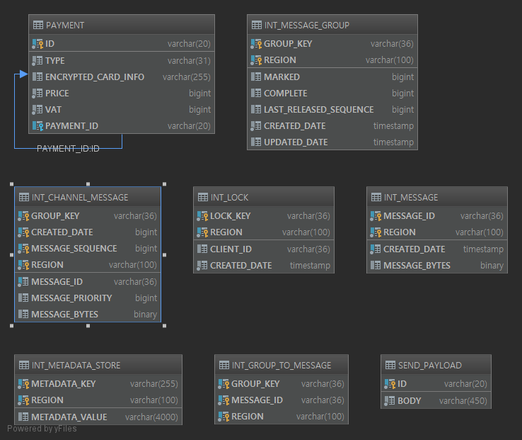

# kakaopay-problem-2
카카오페이 사전과제 2번 (내부 DB 저장 및 카드사로  패킷 전송 시뮬레이션)

## 1. 목적
* 결제, 결제 취소 요청, 조회 API를 개발
* 결제, 결제 취소의 경우에는 내부 테이블에 저장 및 결제 관련 처리를 한 다음에, 카드사에 패킷 전송 실행

* 카드사에 패킷 전송은, 별도의 테이블 구성하고 저장 하는 것으로 대체 

## 2. 개발 환경

- Intellij IDEA Ultimate 2018.3
- OS : Windows 10

## 3. 개발 프레임워크 구성

- 개발 프레임워크 구성은 아래와 같으며, Gradle 스크립트에 의해서 자동으로 로드 및 사용하도록 되어있음

### 3.1. Apache 
개발 편의를 위해 사용

구성>
* apache-commons-lang3 : 3.8.1
* apache_commons-collections4: 4.3
* commons-io : 2.6

###  3.2. Json
Json 스트링을  객체화할 때 사용 

구성>
* jackson-core : 2.9.5
* jackson-databind : 2.9.5

### 3.3. Database
* h2database : 1.4.199


###  3.4. Spring Boot & Spring
Restful 서버 구성 및 DB 엔티티 관리에 사용
spring-integration-jdbc, spring-boot-integration은 분산 락을 활용하여, 특정 카드 또는 결제 ID의 동시 접근을 막는데 사용

* spring-boot-starter-test : 2.1.4.RELEASE
* spring-boot-data-jpa: 2.1.4.RELEASE
* spring-boot-data-rest : 2.1.4.RELEASE
* spring-boot-starter-integration: 2.1.4.RELEASE
* spring-integration-jdbc : 5.1.6.RELEASE


### 3.5. 그 외 

* modelmapper : 2.3.7
값 전달의 편의를 위해 사용, Request 객체와 Value 객체와 형식을 비슷하게 만들고 한번에 매핑할 수 있도록 하기 위해 사용. 

* Lombok : 1.18.6
개발 편의를 위해 사용, Annotation Processor를 활용한 자동 Getter, Setter 기능 및 Builder 생성 시에 사용


## 테이블 구성



위의 테이블 중 대부분은 spring-integration에 의해 자동으로 추가된 것이고, 직접 만든 테이블은 아래와 같음

### 1. PAYMENT
결제 및 취소 정보를 담고 있음

필드 구성>

* ID : 고유 ID
* TYPE : PAYMENT 또는 CANCEL 중 하나
* ENCRYPTED_CARD_INFO : 암호화 된 카드 정보
* PRICE : TYPE이 PAYMENT이면 결제금액, CANCEL이면 취소금액
* VAT : 부가가치세
* PAYMENT_ID : TYPE이 CANCEL이면, 결제 ID를 가짐

소스 상으로는 TYPE이 PAYMENT인 레코드가, 다수의 TYPE가 CANCEL인 레코드를 갖는 1:N 형태로 관리되도록 했음.

그리고 결제 상의 실제로 남아있는 가격을 아래의 방식으로 구함

	남은 가격을 결제 레코드의 결제금액 - SUM(다수의 취소 레코드의 취소금액)

### 2. SEND_PAYLOAD
카드사에 전달된 string 데이터가 저장됨, 지금은 카드사에 진짜로 전달하는 것은 불가능하므로 여기에 저장이 되면 통신이 이루어진 것으로 간주

필드 구성>

* ID : 고유 ID

* BODY : 통신에 사용된 string 데이터

### 3. INT_LOCK
이 테이블은 spring-integration에 의해서 만들어졌으나 언급하는 이유는, 이 테이블이 분산 락을 저장하는 데 사용되기 때문


## 빌드 및 실행 방법
아래와 같이 두 가지 방법이 제공됨.

* Command line에서 직접 실행

``` bash
./gradlew bootRun
```

* Intelli에서 아래의 순서로 실행 

```
1. Sync gradle
2. Run Application
```


## 문제 해결 전략

* 서비스 구성
컨트롤러를 통해서 입력 파라미터에 대한 유효성 검사를 통과하면, 서비스로 진입하게 되는데
이 서비스들이 실질적인 처리를 담당함. 

이 소스를 구성하는 서비스는 아래와 같음.

### 1. CardService

카드 정보와 관련된 처리를 담당하는 서비스, 주로 카드 정보를 암호화 하거나, 복호화를 담당
암호화, 복호화를 위해 범용 클래스인 CipherProvider 및 CardInfoMapper 를 만들고 이 두개를 조합해서 사용함. 각각의 요소에 대한 설명은 아래와 같음.

**제공되는 함수>**
**encrypt, decrypt**


#### 1.1 CipherProvider

CipherProvider는 생성자를 통해 암호화 방식과, 키를 설정해서 인스턴스를 생성하
고, 인스턴스에서 제공하는 암/복호화 함수를 제공하는 역할을 함.

CardService에서는 @Value 어노테이션을 활용하여 application.yml에 설정한 
환경 설정 값을 가져와서 cipherProvider를 생성하여 관리하고 있음.

**제공되는 함수>**
**encrypt, decrypt**


#### 1.2 CardInfoMapper

CardInfoMapper 카드 정보를 구성하는 3요소인 "카드번호", "유효기간", 
"CVC" 이 세개의 값을 구분자의 값을 중간에 집어넣어서 직렬화한 스트링을 만들거
나, 반대로 역직렬화를 해서 CardInfo로 변환하는 기능을 가짐

**제공되는 함수>**
** serialize, deserialize**


### 2. SendService

카드사에 실제로 string 데이터를 전달하는 역할을 시뮬레이션 하는 역할을 담당.
send 함수를 제공하며, send 함수 내부는 요청 받은 정보를 string 데이터로 만들어 SEND_PAYLOAD 테이블에  저장하는 역할을 수행

**제공되는 함수>**
**service**

#### 2.1 Payload, PayloadField, PayloadFormatter

이 서비스에서 제공하는 send 함수의 요청 타입은 Payload 임, 이 타입은 string 데이터로 만들어지기 전에 필요한 부분을 담고 있음.

Payload는 아래와 같이 구성되었으며, PayloadField 어노테이션을 사용하여 string 데이터를 어떻게 구성해야 할지 정의하도록 함

```java
@Data
@Builder
public class Payload {
    @PayloadField(formatter = PayloadFormatter.STRING, start = 0, length = 10)
    private PaymentType type;

    @PayloadField(formatter = PayloadFormatter.STRING, start = 10, length = 20)
    private String id;

    @PayloadField(formatter = PayloadFormatter.NUMBER_L, start = 30, length = 20)
    private String cardNumber;

    @PayloadField(formatter = PayloadFormatter.NUMBER_0, start = 50, length = 2)
    private Integer paymentMonths;

    @PayloadField(formatter = PayloadFormatter.NUMBER_L, start = 52, length = 4)
    private String cardExpiryDate;

    @PayloadField(formatter = PayloadFormatter.NUMBER_L, start = 56, length = 3)
    private String cardVerificationCode;

    @PayloadField(formatter = PayloadFormatter.NUMBER, start = 59, length = 10)
    private Long paymentPrice;

    @PayloadField(formatter = PayloadFormatter.NUMBER_0, start = 69, length = 10)
    private Long vat;

    @PayloadField(formatter = PayloadFormatter.STRING, start = 89, length = 20)
    private String paymentId;

    @PayloadField(formatter = PayloadFormatter.STRING, start = 109, length = 300)
    private String encryptedCardInfo;

    @PayloadField(formatter = PayloadFormatter.STRING, start = 409, length = 37)
    private String reserved;
}
```

Payload의 각 필드마다 선언되어 있는 PayloadField 어노테이션에서는 해당 필드가 string 데이터로 변환될 때, 어디에 위치하는지 그리고 어떻게 변경이 되어야 하는지에 대한 정보를 설정했음.

예를 들어, 위의 소스에서 cardNumber는 String 데이터로 변환시에  NUMBER_L 방식으로 변환되며, String 데이터 상의 위치는 30 번째 위치에서 시작하고, 길이를 20을 차지한다는 의미.

```java
@Retention(RUNTIME)
public @interface PayloadField {
    PayloadFormatter formatter();

    int start();

    int length();
}
```

```java
public enum PayloadFormatter {
    NUMBER() {
        @Override
        String onFormat(Object input, int length) {
            return StringUtils.leftPad(String.valueOf(input), length, " ");
        }
    },
    NUMBER_0() {
        @Override
        String onFormat(Object input, int length) {
            return StringUtils.leftPad(String.valueOf(input), length, "0");
        }
    },
    NUMBER_L() {
        @Override
        String onFormat(Object input, int length) {
            return StringUtils.rightPad(String.valueOf(input), length, " ");
        }
    },
    STRING() {
        @Override
        String onFormat(Object input, int length) {
            return StringUtils.rightPad(String.valueOf(input), length, " ");
        }
    };

    public String format(Object input, int length) {
        String value = Optional
                .ofNullable(input)
                .map(String::valueOf)
                .orElse("");
        return onFormat(value, length);
    }

    abstract String onFormat(Object input, int length);
}
```

위의 소스는 각각 PayloadField 어노테이션과, PayloadFormatter의 소스임.
PayloadFormatter에서는 숫자, 숫자_0, 숫자_L, 문자인 경우에 대해 각각 string 데이터로 바꿔주는 실질적인 함수가 정의되어 있음.


### 3. ApplyPaymentService

**제공되는 함수>**
**doWork**

결제 API에 대한 실질적인 처리 부분을 담당.
진행 순서는 아래와 같음.

3.1. 요청 받은 카드에 대해서 분산 락을 획득, 동시 접근에 대한 방어 수행
→ 분산 락에 사용되는 키는, 요청 받은 카드 정보에 대한 암호화 문자열을 사용.

3.2. DB에 저장하기 위한 결제 정보 생성
→ id 값은 랜덤으로 생성, 생성 로직을 공통으로 사용하기 위해서 생성 함수를 @Bean으로 만들어서 가져오도록 함.

com.kakao.yebgi.server.config.IdConfig 소스 내에 아래와 같이 등록함

```java
@Configuration
public class IdConfig {
    @Bean(Constants.PAYLOAD_ID)
    public Callable<String> randomId() {
        return () -> RandomStringUtils.random(
                Constants.ID_SIZE,
                "0123456789abcdefghijklmnopqrstuvwxyzABCDEFHIJKLMNOPSRQTUVWXYZ"
        );
    }
}
```

3.3. 결제정보 생성시에 Optional 값인 VAT에 대한 실질적인 값을 가져오는 것도 여기에서 담당함.
→ getActualVat라는 함수를 통해서, 만약에 입력받은 VAT 값이 있으면 그것을 가져오고 없으면, (금액 / 11) 에 대한 반올림을 가져오도록 함

3.4. "3.3"에서 가져온 실질적인 VAT 정보와 요청 받은 입력 정보, 그리고 암호화한 카드 정보를 이용하여 DB에 저장, 저장이 완료되면 sendService를 사용하여 전송을 수행.

전송은 앞에서 말한바와 같이 실질적인 전송은 할 수 없어서,, SEND_PAYLOAD에 저장하는 정도로만 수행 

3.5 응답을 생성하여 리턴


### 4. CancelPaymentService

**제공되는 함수>**
**doWork**

취소 API에 대한 실질적인 처리 부분을 담당.
진행 순서는 아래와 같음.

4.1. 요청 정보에 있는 결제 ID를 사용하여 분산 락을 획득, 동시 접근에 대한 방어 수행

4.2. 요청 정보에 있는 결제 ID를 사용하여, DB 에서 결제 정보를 가져옴.

4.2. 결제 정보와 요청 정보를 함께 사용하여, 알맞은 조건인지에 대한 유효성 검사를 수행, 수행 절차는 아래와 같음.
	4.3.1 결제 정보와 1:N 관계로 엮여있는 취소 정보 목록에 대한 금액의 합을 구함, 이 값이 요청한 금액보다 적으면 "NOT_ENOUGH_PRICE" 오류 발생

	4.3.2 VAT에 대해서도 취소 정보 목록에 대한 VAT의 합을 구하고, 이 값이 요청한 VAT 값보다 적으면 "NOT_ENOUGH_VAT" 오류 발생
	
	4.3.3 마지막으로 금액과 VAT 모두 감소가 되었을 경우에, 만약 감소된 VAT가 오히려 감소된 금액보다 크면 "VAT_GREATER_THAN_PRICE" 오류 발생

4.3 취소 정보 저장, 이 때 취소에 사용되는 vat 값을 유효성 검사를 통해서 찾아낸 vat 값을 사용

```java
long remainingPrice = applyPayment.getRemainingPrice();
long remainingVat = applyPayment.getRemainingVat();

long requirePrice = request.getPrice();
long requireVat = Optional
	.ofNullable(request.getVat())
    .orElse(Math.min(remainingVat, request.getDefaultVat()));
```

위의 소스는 4.2 항목에서 진행된  유효성 검사에 사용할 파라미터를 계산하는 부분인데, 여기서 requireVat 이 실질적인 취소를 요청해야 할 VAT 금액이 됨.

입력받은 VAT가 있으면 그대로 사용하고, 만약 없으면 (금액 / 11) 와 현재 남아있는 VAT와 비교해서 작은 값을 가져옴.

4.4 응답을 생성하여 리턴


### 5. SearchPaymentService

**제공되는 함수>**
**doWork**

조회 API에 대한 실질적인 처리 부분을 담당.
진행 순서는 아래와 같음.

5.1. 요청 정보에 있는 ID를 사용하여 결제, 취소 관계없이 저장된 항목을 요청

5.2. 가져온 항목이 있으면, cardService를 사용하여 가져온 항목에 있는 암호화 데이터를 복호화 

5.3 응답을 생성, 생성 시에 사용하는 카드 정보를 "*" 문자로 마스킹된 형태를 지원하는 MaskedCardInfo 클래스를 사용

5.4 생성한 응답을 리턴


## 방어코드 증명

* 동일한 카드에서 동시에 결제를 시도하는 부분을 방지

1. com.kakao.yebgi.server.service.payment.ApplyPaymentService 클래스 내부에 있는 lockCardInfo 함수에 의해서 암호화 된 카드 정보를 키로 하여, 분산 락을 생성.
만약, 이미 사용 중인 분산 락에 접근이 감지되면 "CARD_LOCKED" 에러를 리턴하도록 함.
소스는 아래와 같음.

```java
private Lock lockCardInfo(String encryptedCardInfo) throws ApiException {
    Lock lock = lockRegistry.obtain(encryptedCardInfo);

    if (lock.tryLock()) {
        return lock;
    } else {
        throw new ApiException(ApiError.CARD_LOCKED);
    }
}
```

2. 해당 기능에 대한 단위 테스트는 com.kakao.yebgi.server.MultiThreadTest에 있는 "같은카드로_동시에_결제테스트"를 통해서 확인 가능
→  같은 카드로 결제를 시도하는 Worker를 두개 만들어서 동시에 시도하면, 하나만 성공하고 다른 하나는 CARD_LOCKED가 발생함을 확인 할 수 있음

* 동일한 결제 ID에서 동시에 취소를 시도하는 부분을 방지

1. com.kakao.yebgi.server.service.payment.CancelPaymentService 클래스 내부에 있는 lockPayment 함수에 의해서 결제 ID를  키로 하여, 분산 락을 생성.
만약, 이미 사용 중인 분산 락에 접근이 감지되면 "PAYMENT_LOCKED" 에러를 리턴하도록 함.
소스는 아래와 같음.

```java
private Lock lockPayment(ApplyPayment applyPayment) throws ApiException {
	String key = applyPayment.getId();
    Lock lock = lockRegistry.obtain(key);

    if (lock.tryLock()) {
    	return lock;
	} else {
        throw new ApiException(ApiError.PAYMENT_LOCKED);
    }
}
```

2. 해당 기능에 대한 단위 테스트는 com.kakao.yebgi.server.MultiThreadTest에 있는 "동일거래로_동시에_거래취소_테스트"를 통해서 확인 가능
→  같은 결제 ID로 취소를 시도하는 Worker를 두개 만들어서 동시에 시도하면, 하나만 성공하고 다른 하나는 PAYMENT_LOCKED 가 발생함을 확인 할 수 있음


## 단위 테스트

단위 테스트는 "src\test\java\com\kakao\yebgi\server" 폴더 아래에 있는 파일들을 실행 

제공되는 단위 테스트 파일은 아래와 같음

* request\payment\ApplyPaymentRequestTest.java : 결제 입력 유효성 테스트
* request\payment\CancelPaymentRequestTest.java : 취소 입력 유효성 테스트
* request\payment\SearchPaymentRequestTest.java : 조회 입력 유효성 테스트
* request\CardRequestTest.java : 카드 정보 입력 유효성 테스트
* MultiThreadTest.java : 멀티스레드 기반 테스트
* PaymentTest.java : 결제 및 취소, 전체취소, 부분취소 테스트
* SearchTest.java : 조회 테스트


## 오류 코드 

해당 API는 오류가 발생하면 오류 코드 및 설명을 리턴하도록 되어있음
에러 정보는 com.kakao.yebgi.server.constant.ApiError 내에 저장되어 있으며, 그 목록은 아래와 같음.
(왼쪽은 Enum 이름, ":" 뒤에 있는 값들이 정보)

**ERROR** : code = 1, description = "오류"
**INVALID_PARAMETER** : code = 2, description = "누락 또는 잘못된 형식으로 입력했습니다."
**CARD_LOCKED** : code = 11, description = "현재 결제가 진행 중인 카드 정보는 사용할 수 없습니다."
**PAYMENT_LOCKED** : code = 21, description = "현재 취소가 진행 중인 결제 ID는 사용할 수 없습니다."
**PAYMENT_NOT_FOUND** : code = 22, description = "결제 정보를 찾을 수 없습니다."
**NOT_ENOUGH_PRICE** : code = 31, description = "금액이 부족합니다."
**NOT_ENOUGH_VAT** : code = 32, description = "VAT가 부족합니다."
**VAT_GREATER_THAN_PRICE** : code = 33, description = "VAT가 금액보다 더 큽니다."


**예시>**
아래는 결제를 요청할 때, 카드 번호를 짧게 입력했을 경우임.
입력은 아래와 같이 진행

URL : http://localhost:8080/api/payment/v1/apply
METHOD : POST
전달 값 :

```
{"price":11000,"vat":1000,"card":{"number":"11232","expiryDate":"0120","verificationCode":"123"},"months":0}
```

결과는 아래와 같음
```
{
    "apiError": "INVALID_PARAMETER",
    "details": [
        {
            "field": "applyPaymentRequest",
            "message": "카드번호는 10 ~ 16자리 숫자로 입력해야 합니다."
        }
    ],
    "description": "누락 또는 잘못된 형식으로 입력했습니다.",
    "code": 2
}
```


## 제공 API

### 1. 결제 API
**URL** : /api/payment/v1/apply
**방식** : POST
**입력 양식>**
```json
{
  "price": 결제금액,
  "vat": 부가가치세,
  "card": {
    "number": "카드_번호",
    "expiryDate": "카드_유효기간",
    "verificationCode": "카드_CVC"
  },
  "months": 결제개월(0 = 일시불)
}
```

**출력 양식>**
```json
{
  "id": "생성된 결제 ID"
}
```


**예시 - 입력>**

```json
{
  "price": 11000,
  "vat": 1000,
  "card": {
    "number": "1234567890",
    "expiryDate": "0120",
    "verificationCode": "123"
  },
  "months": 0
}
```

**예시 - 결과>**
```json
{
  "id": "lsyIaNnhX3EusaRim5lY"
}
```


### 2. 취소 API

**URL** : /api/payment/v1/cancel
**방식** : POST
**입력 양식>**

```json
{
  "price": 취소_금액,
  "vat": 취소_부가가치세,
  "paymentId": "등록된_결제_ID"
}
```

**출력 양식>**
```json
{
  "id": "생성된 취소 ID"
}
```


**예시 - 입력>**

```json
{
  "price": 11000,
  "vat": 1000,
  "paymentId": "lPiCnWMOmWP4xKNryqfi"
}
```

**예시 - 결과>**
```json
{
  "id": "IlSLNEt6fcbye3ZzlqIT"
}
```


### 3. 조회 API

**URL** : /api/payment/v1/search
**방식** : POST
**입력 양식>**
```json
{
  "id": "조회_ID"
}
```

**출력 양식>**
{
  "id": "조회_ID",
  "cardInfo": {
    "number": "일부_가려진_카드번호",
    "expiryDate": "카드_유효기간",
    "verificationCode": "카드_CVC"
  },
  "paymentType": "타입(**결제**: PAYMENT, **취소**: CANCEL)",
  "price": 금액(**타입이 결제라면 취소되고 남은 금액 표시**),
  "vat": 부가가치세(**타입이 결제라면 취소되고 남은 금액 표시**)
}


**예시 - 입력>**

```json
{
  "id": "3WcOoAUwrddAajDAO5wp"
}
```

**예시 - 결과>**
```json
{
  "id": "3WcOoAUwrddAajDAO5wp",
  "cardInfo": {
    "number": "***4567***",
    "expiryDate": "0120",
    "verificationCode": "123"
  },
  "paymentType": "PAYMENT",
  "price": 11000,
  "vat": 1000
}
```